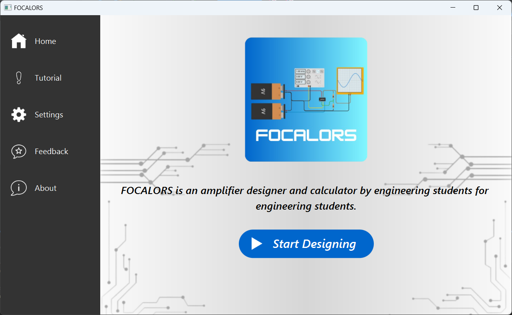

<div>
    <h1 align="center">Focalors</h1>
    <h3 align="center">An amplifier designer and calculator circuit, by engineering students for engineering students.</h3>
    <h3 align="center">Powered by Java and JAVAFX.</h3>
</div>



<br>
Focalors is an amplifier designer built with Java designed to help engineers, students, and hobbyists determine the best values for their next electronic amplification endeavors.

## Try
Install the following dependencies using pip
```
pip install flet flet_route firebase_admin pillow google-auth opencv-python qrcode cairosvg
```
Clone repository and change directory
```
git clone https://github.com/neverbdneverw/morax.git
cd morax
```

Start Morax on your system
```
python main.py
```

## Discussions
If you want to ask any questions or provide feedback, you can make issues in this repository

## Contributing
Feel free to send pull requests to this repository with your code.


<br>
<sup><b>License</b>: MIT License</sup>

## A project by:

## Never back down, never what

### Malicsi, Owen David P.
### Paña, Ralph John H.
### Torino, Tristan Kirby E.
### Fernandez, Achilles Maximus M.
### Comprendio, Emmanuel James H.
